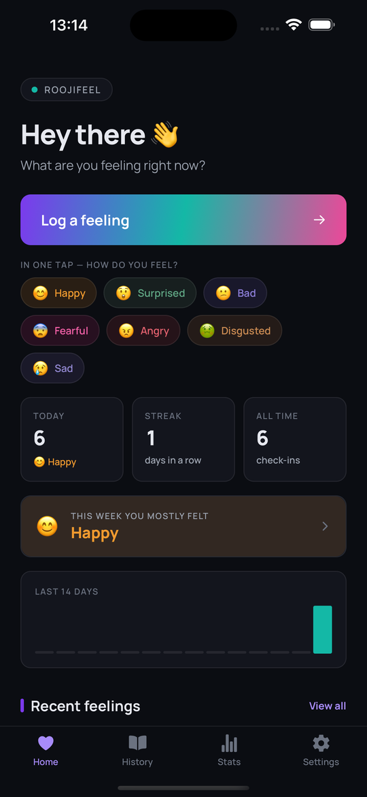
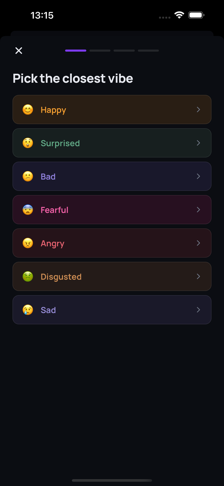
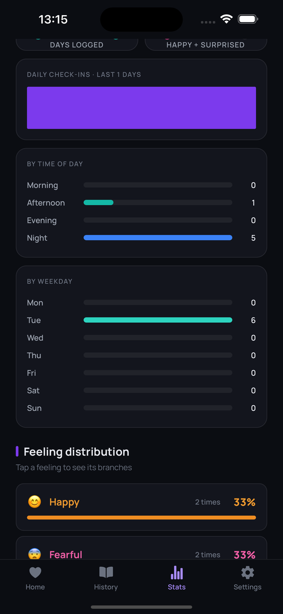
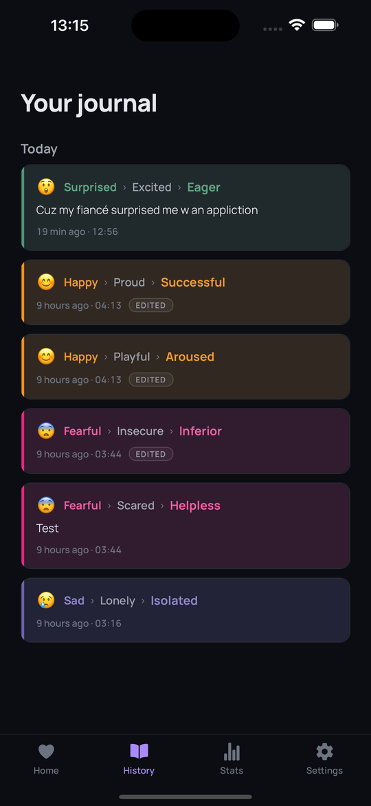

# Roojifeel 🎡

A cozy, private feelings journal for iOS and Android — built on the
[Feelings Wheel](https://feelingswheel.com/). Whenever you feel something,
drill down through the wheel's three rings (core → branch → exact feeling),
add an optional note about why, and Roojifeel keeps it on your device with
the exact date and minute. Nothing is ever uploaded.

## Screenshots

| Home | Log a feeling | Stats | Journal |
|:---:|:---:|:---:|:---:|
|  |  |  |  |

## Features

- **3-level feeling picker** mirroring the classic feelings wheel
  (7 core emotions → 41 branches → 130+ exact feelings), each rendered
  in its authentic wheel color
- **Notes** — capture *why* you feel this way
- **Journal** — day-grouped, color-coded history; tap to edit (entries get
  an `edited` tag), long-press to delete
- **Stats dashboard** — donut of your feeling distribution, consistency
  and positivity gauges, daily activity bars, per-core branch drill-down,
  and your top-named feelings over a configurable range (7/14/30/90 days)
- **Daily reminder** — a gentle "What are you feeling right now?" local
  notification at a time you choose
- **Import / export** — your full history as JSON, shareable and restorable
- **English + العربية** with full RTL layout
- **100% on-device** — SQLite storage, no accounts, no servers, no analytics

## Tech

- [Expo](https://expo.dev) SDK 57 / React Native 0.86 / TypeScript
- expo-router, react-native-reanimated 4, react-native-svg, expo-sqlite
- Design language inspired by dark glassy console UIs: deep space
  background, purple→teal→pink tri-color, glow accents

## Install

### Android

1. Download `Roojifeel-vX.Y.Z.apk` from the
   [latest release](../../releases/latest).
2. Open it on your phone and allow "install from unknown sources"
   when prompted.

### iOS

The `Roojifeel-vX.Y.Z.ipa` in releases is **unsigned** (no paid Apple
Developer account). Install it with one of:

- [AltStore](https://altstore.io) / [SideStore](https://sidestore.io) —
  re-signs with your free Apple ID (7-day renewable)
- Xcode — open the project, set your Personal Team under
  Signing & Capabilities, and run on your device

## Development

```bash
npm ci
npx expo start          # dev server (Expo Go or simulator)
npx expo prebuild       # generate native projects
```

> **Note:** `patches/` contains a [patch-package](https://github.com/ds300/patch-package)
> fix for `expo-modules-jsi@57.0.4` on Xcode 26.1 (Swift `weak let`
> incompatibility). It applies automatically via the `postinstall` script.

Build release artifacts locally:

```bash
# APK
cd android && ./gradlew assembleRelease

# IPA (unsigned)
cd ios && xcodebuild -workspace Roojifeel.xcworkspace -scheme Roojifeel \
  -configuration Release -destination 'generic/platform=iOS' \
  build CODE_SIGNING_ALLOWED=NO
```

## License

MIT
