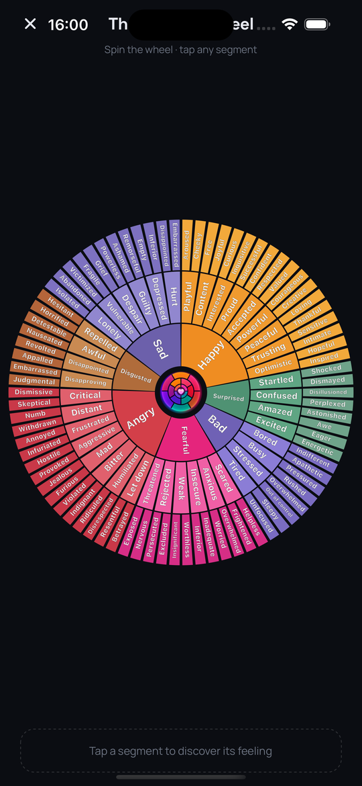

# Roojifeel

A cozy, private feelings journal for iOS and Android — built on the
[Feelings Wheel](https://feelingswheel.com/). Whenever you feel something,
drill down through the wheel's three rings (core → branch → exact feeling),
capture the why with notes, photos or voice, and watch your patterns bloom.
Everything stays on your device. Nothing is ever uploaded.

## Screenshots

| Home | The Wheel | Stats | Journal | Log |
|:---:|:---:|:---:|:---:|:---:|
|  |  |  |  |  |

## Features

### Capture
- **3-level feeling picker** mirroring the classic feelings wheel
  (7 cores → 41 branches → 130+ exact feelings), each in its authentic color
- **Multiple feelings per check-in** — real moments are mixed
- **Intensity slider** (1–5), **tags** (#work, #family…) with suggestions,
  **photo attachments** (camera or library), and **voice memos**
- **Quick-log mood orbs** on Home — one tap opens the wheel at that core

### The Feelings Wheel explorer
- A fullscreen, **spinnable** (with inertia), **pinch-zoomable** (1–3.2×)
  rendition of the whole wheel, every segment labeled in English and Arabic
- Tap any segment to highlight its family and **log it in one tap**

### Understand
- **Stats dashboard** — feeling-distribution donut, consistency and
  positivity gauges, daily activity, time-of-day and weekday breakdowns,
  per-core branch drill-down, top feelings
- **Kibana-style time ranges** — quick presets or absolute from/to dates
- **Mood calendar** — each day tinted by its dominant feeling
- **Trends** — 12-week positivity % and average-intensity lines with
  moving averages
- **Monthly Wrapped ✨** — a shareable summary card of your month
- **Mood flow strip, weekly insight, and one-week-ago memory** on Home

### Gentle habit
- **Smart reminders** — any number of exact times per day; reminders skip
  themselves once you've logged, and a soft nudge arrives after 3 quiet days
- **Streak milestones** (3/7/14/30/60/100/365 days) with a cozy one-time
  celebration; **30 rotating daily reflection prompts**
- **First-launch onboarding** — the wheel, the privacy promise, reminders

### Yours alone
- **100% on-device** — SQLite storage, no accounts, no servers, no analytics
- **Auto-backup** to storage *you* own (Files app on iOS, any folder on
  Android — Google Drive capable), plus manual JSON export/import
- **English + العربية** with full RTL, instant switching
- **Home-screen widgets** on both Android and iOS — today's mood and a
  one-tap log button
- **Optional haptics**, dark glassy design, Space Grotesk + Manrope +
  IBM Plex Sans Arabic

## Install

### Android

1. Download `Roojifeel-vX.Y.Z.apk` from the
   [latest release](../../releases/latest) (or the `-universal` build for
   old 32-bit devices and emulators).
2. Open it on your phone and allow "install from unknown sources".

### iOS

The `Roojifeel-vX.Y.Z.ipa` in releases is **unsigned** (no paid Apple
Developer account). Install it with one of:

- [AltStore](https://altstore.io) / [SideStore](https://sidestore.io) —
  re-signs with your free Apple ID (7-day renewable)
- Xcode — open the project, set your Personal Team under
  Signing & Capabilities, and run on your device

## Development

Expo SDK 57 · React Native 0.86 · TypeScript · expo-router ·
Reanimated 4 · react-native-svg · expo-sqlite · expo-widgets

```bash
npm ci
npx expo start          # dev server (simulator / device)
npx expo prebuild       # generate native projects
```

> **Note:** `patches/` contains a [patch-package](https://github.com/ds300/patch-package)
> fix for `expo-modules-jsi@57.0.4` on Xcode 26.1 (Swift `weak let`
> incompatibility). It applies automatically via the `postinstall` script.

Build all release artifacts (slim APK, universal APK, unsigned IPA):

```bash
./scripts/release.sh    # outputs to release-out/
```

## License

MIT
